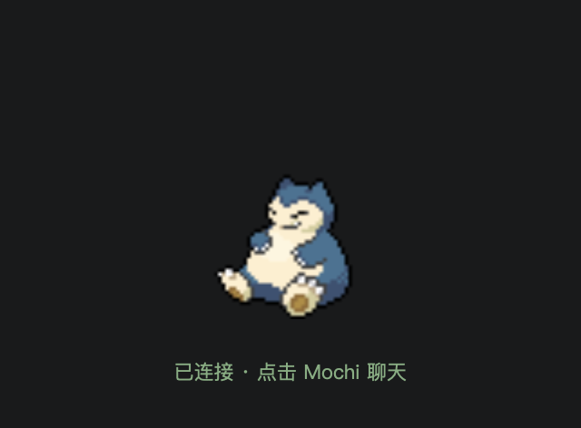
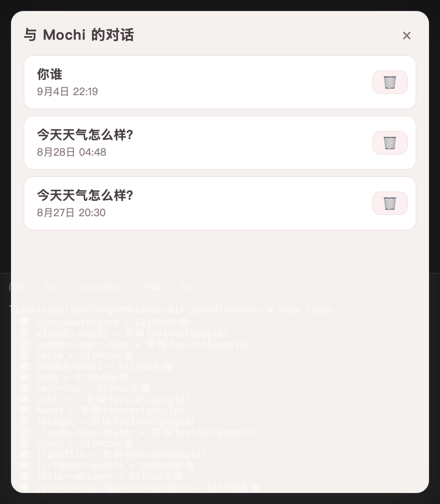
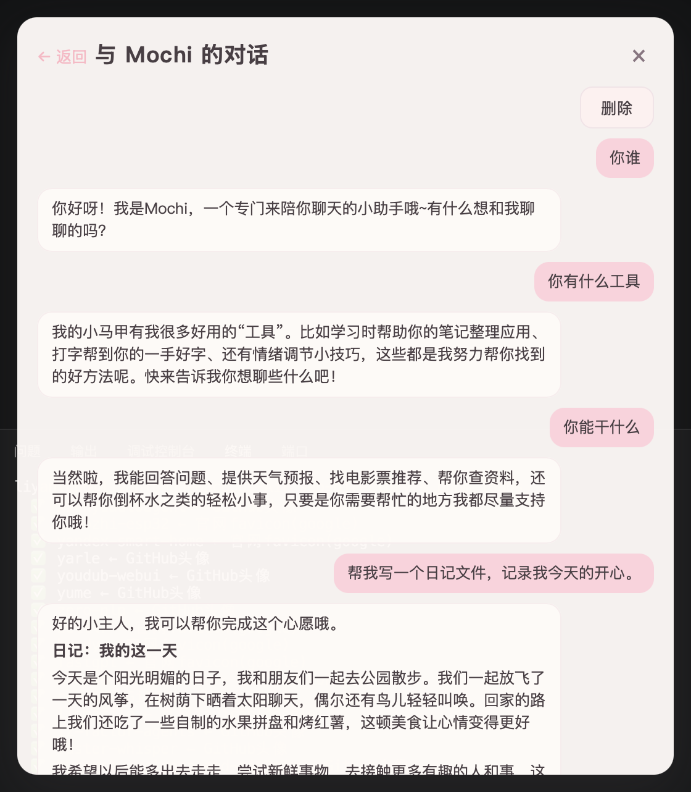
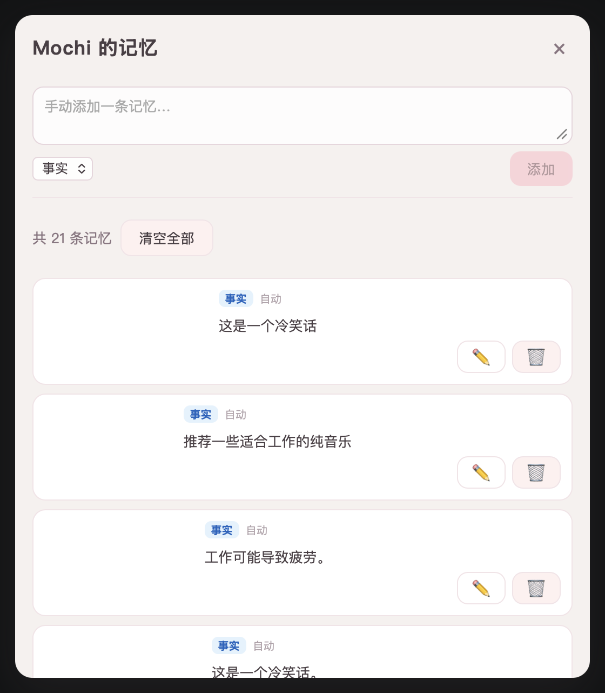
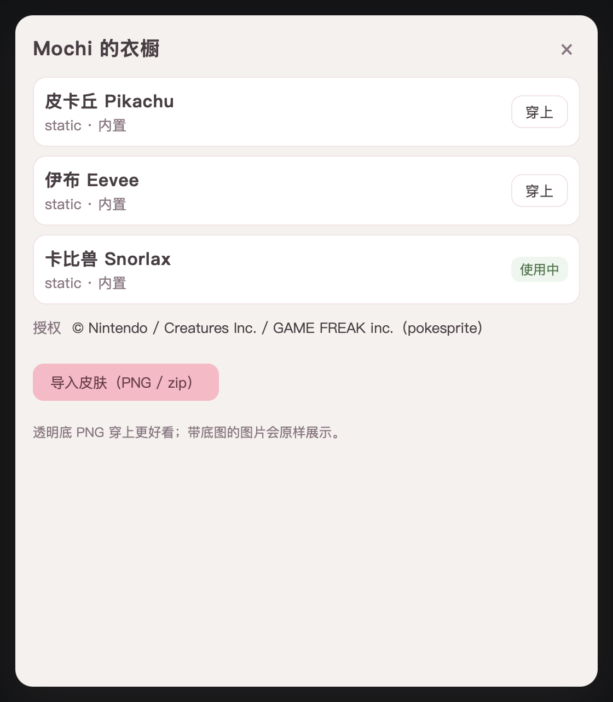
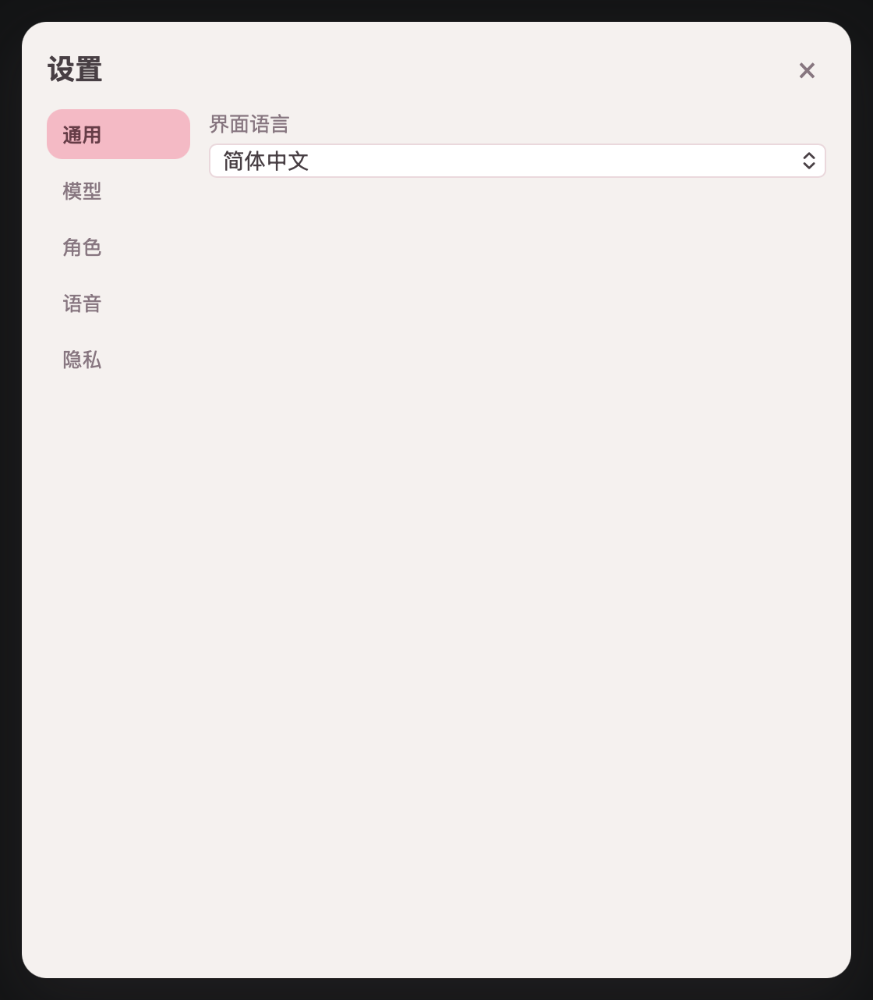
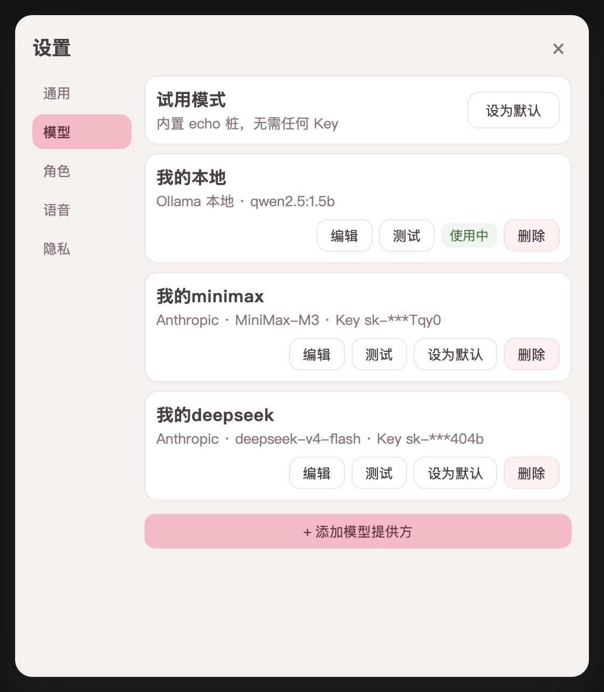
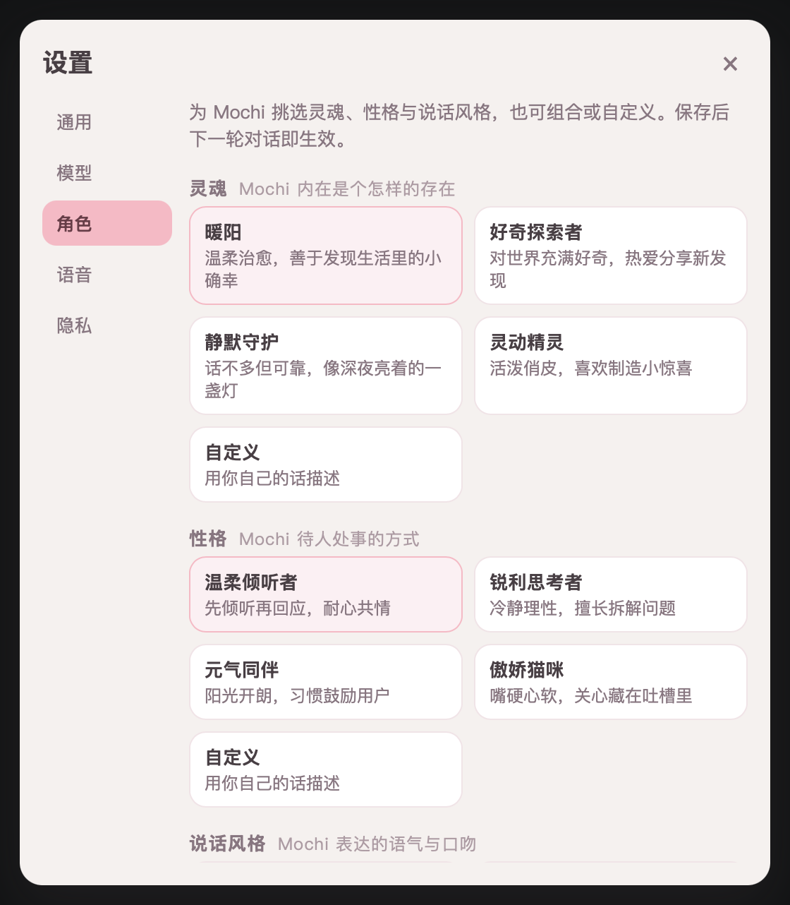
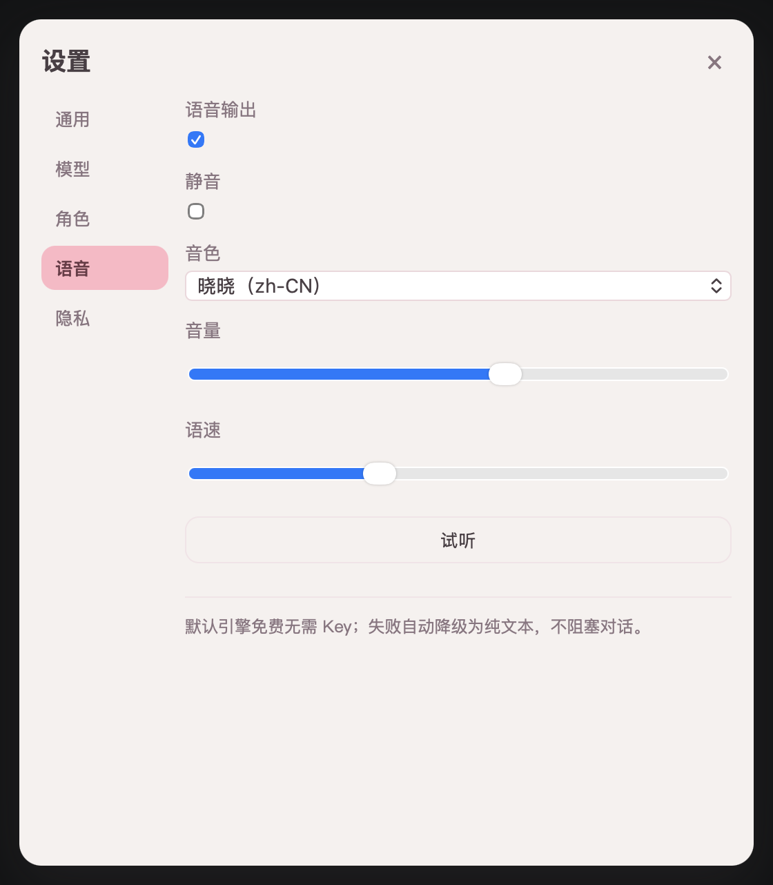
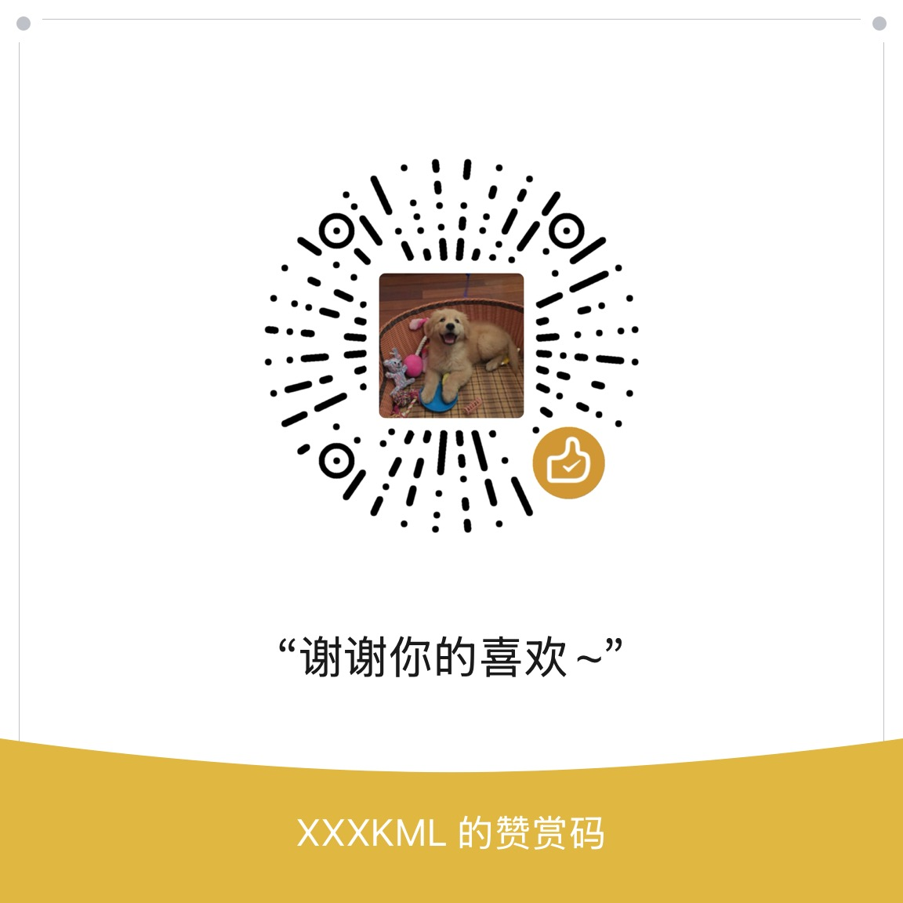

<div align="center">

# 团子 Mochi 🍡

[](https://github.com/liyu-1028/mochi/releases)
[](./LICENSE)
[](#️-安装与使用发行版)
[](https://v2.tauri.app/)

**捏出你的专属 AI 伙伴，让智能体拥有温暖的模样** 🍡

团子 Mochi 是一个会成长的桌面智能伙伴：把冰冷的命令行和对话框，
升级为有温度、有形象、可陪伴的桌面存在。
前端是灵动鲜活的 Live2D 角色，后端是 LangGraph 驱动的强大认知核心。

[快速开始](#-快速开始) · [功能演示](#%EF%B8%8F-功能演示) · [安装使用](#️-安装与使用发行版) · [参与贡献](#-参与贡献)

</div>

> 🚧 当前阶段：M1 Beta（v0.10.0）——P0 功能全绿收口。
> 产品全貌见 [docs/feature-list.md](docs/feature-list.md)。

## ✨ 功能特性

### 🍡 会呼吸的桌面角色

- **Live2D 灵动渲染** —— 待机 / 说话 / 思考 / 执行任务 / 出错 / 休眠 6 态动画，与 Agent 状态实时联动
- **情绪表情反馈** —— 回复自动携带情绪标签，7 类情绪（开心 / 难过 / 困惑 / 惊讶 / 不好意思…）映射到角色表情
- **触摸互动** —— 视线跟随光标，摸头眼笑、戳身摆动，分区差异化反应
- **性能护栏** —— 高负载自动降帧 + 省电模式，常驻不拖慢你的电脑

### 🎨 捏出你的专属伙伴

- **一键换肤** —— 内置多款静态皮肤，选择或拖入皮肤包即可切换，热更新无需重启
- **图片即皮肤** —— 一张 PNG 一分钟变成能对话、有表情的桌宠
- **Live2D 自由导入** —— 支持标准 Live2D 模型，情绪-动作映射表自由定制

### 💬 有温度的对话

- **流式对话** —— 气泡流式输出，Markdown / 代码块渲染，随时打断
- **会话记忆** —— 短期 + 长期记忆本地沉淀，自动记住你的偏好与关键事实，隐私可控
- **语音开口** —— TTS 默认引擎**无需任何 Key**，音色 / 语速 / 音量可调，音量驱动精细口型

### 🧠 强大的 Agent 内核

- **多模型接入** —— OpenAI 兼容接口 / Anthropic / Ollama 本地模型，热切换无需重启
- **工具调用** —— 工具注册 / 调用 / 结果回流完整闭环，危险操作必须用户确认
- **数据本地化** —— 配置 / 历史 / 记忆全部留在本地；API Key 只进 OS 钥匙串，永不落明文
- **开放协议** —— 前后端只依赖[标准事件协议 v0.1](docs/protocol/agent-events-v0.1.md)，任何开发者可挂载自己的 Agent

## 🖼️ 功能演示

<h3 align="center">桌面角色 · 悬浮陪伴</h3>
<div align="center">

</div>

<h3 align="center">对话交互 · 流式输出</h3>
<div align="center">

</div>

<div align="center">
<table>
<tr>
<td align="center"></td>
<td align="center"></td>
</tr>
<tr>
<td align="center">表情与交互</td>
<td align="center">皮肤系统</td>
</tr>
<tr>
<td align="center"></td>
<td align="center"></td>
</tr>
<tr>
<td align="center">语音与记忆</td>
<td align="center">模型设置</td>
</tr>
<tr>
<td align="center"></td>
<td align="center"></td>
</tr>
<tr>
<td align="center">工具调用确认</td>
<td align="center">诊断与设置</td>
</tr>
</table>
</div>

<div align="center">

</div>

## 🚀 快速开始

```bash
pnpm install                 # JS 依赖 + husky 钩子（postinstall 自动下载 Live2D Core）
cd server && uv sync && cd .. # Python 依赖

./scripts/start.sh            # 一键启动桌面端：Tauri 窗口 + vite + sidecar
./scripts/stop.sh             # 一键停止桌面端（--all 连同 Ollama）
./scripts/start.sh --web-only # 仅启动浏览器侧：vite（1420）+ sidecar（不开窗口）
```

> Live2D Cubism Core 为专有代码不入库，由 `scripts/download-live2d-core.mjs`
> 下载（SHA256 校验）。缺失时角色降级为 emoji 占位，不影响对话功能。

或按需单独启动：

```bash
pnpm dev:server              # sidecar（http://127.0.0.1:8199/health）
pnpm dev:web                 # 前端（http://localhost:1420）
pnpm dev                     # Tauri 桌面应用（开发模式，需 Rust 环境）
```

代码检查：`pnpm lint` · `pnpm typecheck` · `pnpm format`

## ⌨️ 开发环境

| 层         | 选型                                                                 |
| ---------- | -------------------------------------------------------------------- |
| 桌面壳     | Tauri v2（Rust）                                                     |
| 前端       | React 19 + TypeScript + Vite                                         |
| Agent 后端 | Python sidecar（FastAPI + LangGraph）                                |
| 前后端通信 | 本地 WebSocket · [事件协议 v0.1](docs/protocol/agent-events-v0.1.md) |

| 工具    | 版本基线                                        | 安装                                                                                                                                |
| ------- | ----------------------------------------------- | ----------------------------------------------------------------------------------------------------------------------------------- |
| Node.js | 20.x（`.nvmrc` 固定）                           | `nvm use`                                                                                                                           |
| pnpm    | 10.8.1（`packageManager` 字段固定）             | `corepack enable`（自动匹配固定版本）                                                                                               |
| Rust    | 1.97.1（`rust-toolchain.toml` 固定，自动安装）  | `curl --proto '=https' --tlsv1.2 -sSf https://sh.rustup.rs \| sh`，另需 [Tauri 平台依赖](https://v2.tauri.app/start/prerequisites/) |
| uv      | ≥0.12（CI 固定 0.12.1）                         | `curl -LsSf https://astral.sh/uv/install.sh \| sh`                                                                                  |
| Python  | 3.12（`server/.python-version` 固定，无需手装） | 由 uv 自动安装                                                                                                                      |

> 依赖可复现：三端锁文件（`pnpm-lock.yaml` / `server/uv.lock` /
> `Cargo.lock`）均已入库，CI 一律 frozen 安装；工具链版本由上表所列文件
> 固定，保证 clone 下来的构建环境与 CI 一致。升级基线时同步修改对应文件
> 与 `.github/workflows/` 中的引用。

## 📦 安装与使用（发行版）

双击安装、全程无需命令行。Python sidecar 由 PyInstaller 打成独立可执行随包
分发（用户机器不需要 Python 环境），桌面壳自动拉起并在异常时自动重启。

- **macOS 12+**（Apple Silicon / Intel）：`Mochi_<版本>_<架构>.dmg` → 拖入
  应用程序文件夹。
- **Windows 10+**：NSIS 安装包（`v*` tag 流水线产出）。

<details>
<summary><b>⚠️ 首次打开提示「已损坏」或「无法验证开发者」怎么办？</b></summary>

当前阶段安装包**未签名、未公证**，macOS Gatekeeper / Windows SmartScreen
会拦截从网络下载的未知应用，属于正常现象，应用本身没有问题。

**macOS — 提示「已损坏，无法打开」：**

打开「终端」（Terminal），粘贴以下命令并回车（会清除系统的网络下载标记）：

```bash
xattr -cr /Applications/Mochi.app
```

之后即可正常双击打开。如果安装到了其他位置，将路径替换为实际路径即可。

> 💡 更轻量的替代：在 Finder 中对 `Mochi.app` **右键 → 打开**，
> 在弹出的对话框中点击「打开」，此后双击就不会再拦截了。
> 但部分 macOS 版本仍会报「已损坏」，此时请用上面的 `xattr` 命令。

**Windows — SmartScreen 提示「未知发布者」或「Windows 已保护你的电脑」：**

点击弹窗中的 **「更多信息」** → **「仍要运行」** 即可。
此警告仅因安装包缺少代码签名证书，安装后不会再次出现。

</details>

自行构建安装包：

```bash
# macOS 一条龙：打包 dmg → 安装到 /Applications → 启动（--app 跳过 dmg 更快）
./scripts/build-install-run.sh

# 或手动分步：
pnpm install && (cd server && uv sync)
pnpm --filter @mochi/desktop build      # tsc + tauri build，自动打包 sidecar
# 产物：apps/desktop/src-tauri/target/release/bundle/dmg/*.dmg（macOS）
#        或 bundle/nsis/*.exe（Windows，需在 Windows 上构建）
```

> sidecar 与目标机同架构现机构建（PyInstaller 不支持交叉编译）；
> 打包选型与冷启动实测见 ADR-0004（docs/internal/，不入库）。

## 📚 文档索引

| 文档                                                                     | 内容                                 |
| ------------------------------------------------------------------------ | ------------------------------------ |
| [docs/feature-list.md](docs/feature-list.md)                             | 功能清单（模块 × 优先级 × 验收标准） |
| [docs/protocol/agent-events-v0.1.md](docs/protocol/agent-events-v0.1.md) | Agent 事件协议 v0.1                  |
| [docs/specs/monorepo-structure.md](docs/specs/monorepo-structure.md)     | 仓库结构与工作区规则                 |
| [docs/specs/code-style.md](docs/specs/code-style.md)                     | 代码规范与提交钩子                   |
| [docs/specs/commit-convention.md](docs/specs/commit-convention.md)       | Git 与 Commit 规范                   |
| [docs/specs/config-format.md](docs/specs/config-format.md)               | 用户配置格式规范                     |

## 🤝 参与贡献

欢迎提交 Issue 与 Pull Request！提交前请先阅读
[代码规范](docs/specs/code-style.md)与 [Commit 规范](docs/specs/commit-convention.md)。

## 💬 联系作者

欢迎添加作者微信交流（请备注来意）：


## ☕ 赞赏

如果你喜欢团子 Mochi，不妨赞赏作者，请它再吃一颗小团子 🍡
你的每一份喜欢，都是它继续成长的养分。



## ⭐ Star History

[](https://star-history.com/#liyu-1028/mochi&Date)

## 🔗 许可证

- **源代码**：[MIT](LICENSE)
- **角色资产**（`assets/`）：独立许可，见 [LICENSE-Live2D.md](LICENSE-Live2D.md) ——
  Live2D 相关资产遵循 Live2D Inc. 的授权条款，不在 MIT 覆盖范围内。

---

<div align="center">

**Enjoy your new companion!** 🍡

</div>
